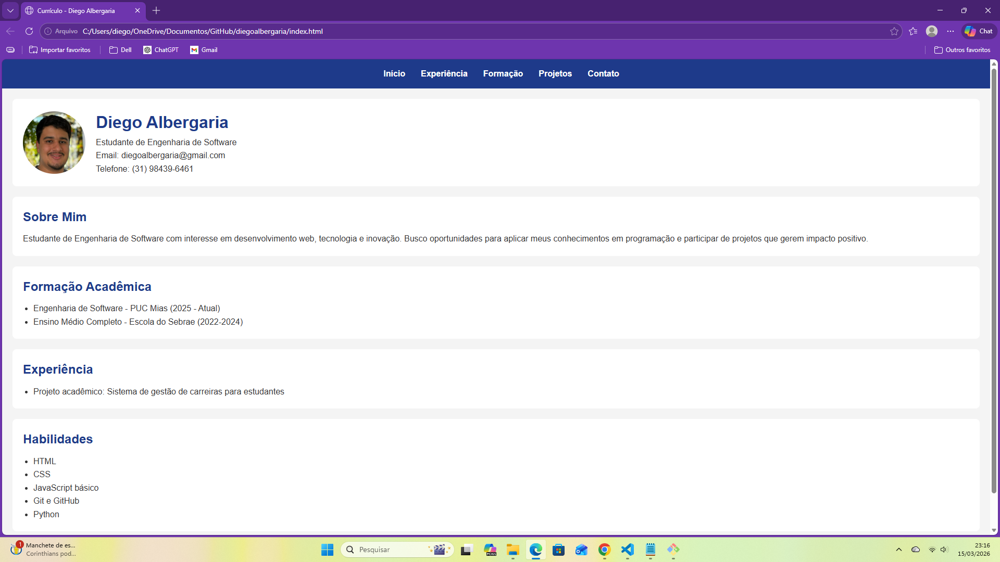

## Hi there 👋

<!--
**diegoalbergaria/diegoalbergaria** is a ✨ _special_ ✨ repository because its `README.md` (this file) appears on your GitHub profile.

Here are some ideas to get you started:

- 🔭 I’m currently working on ...
- 🌱 I’m currently learning ...
- 👯 I’m looking to collaborate on ...
- 🤔 I’m looking for help with ...
- 💬 Ask me about ...
- 📫 How to reach me: ...
- 😄 Pronouns: ...
- ⚡ Fun fact: ...
-->
Diego Albergaria 883517

# Projeto Responsivo com Bootstrap

## Nome
Diego Albergaria

## Curso
Engenharia de Software

## Descrição do projeto
Este projeto consiste na refatoração da home-page desenvolvida anteriormente, agora utilizando o framework Bootstrap para criar uma versão responsiva.

A página foi organizada com os seguintes elementos:
- Cabeçalho com nome do site e menu de navegação
- Seção principal com imagem/banner e texto introdutório
- Seção de cards com três conteúdos do site
- Rodapé com links institucionais e redes sociais

A responsividade foi implementada com as classes do Bootstrap, permitindo:
- Exibição em duas colunas na versão desktop
- Exibição em uma coluna na versão mobile

## Tecnologias utilizadas
- HTML5
- CSS3
- Bootstrap 5
- Git
- GitHub

## Prints do projeto

### Versão Desktop

### Versão Mobile

## Repositório
https://github.com/diegoalbergaria/diegoalbergaria.git